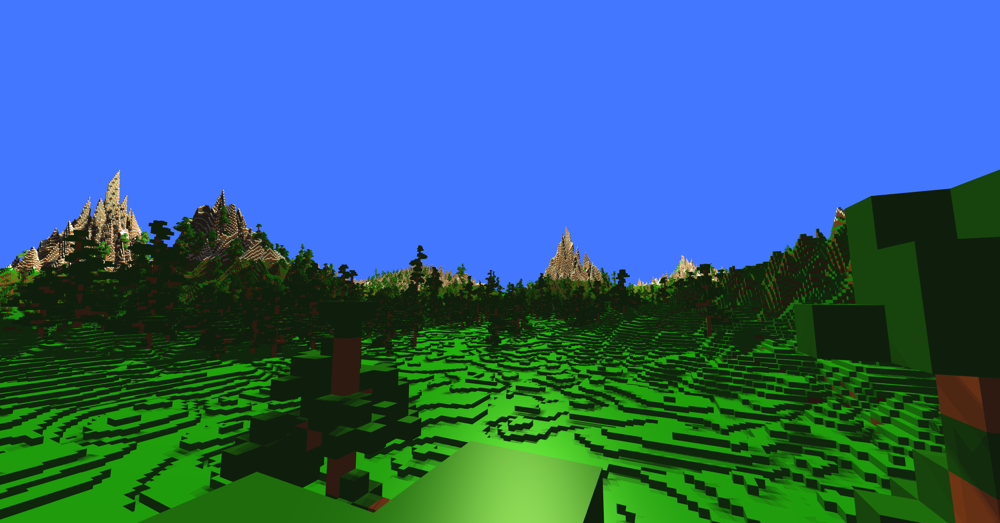

# Procedural voxel generation

## Screenshots

## Introduction
This project is a voxel engine with procedural terrain generation. Some of its features include:
- Rendering with THREE.js
- Player does not fall through the terrain, this is accomplished through raycasting
- Terrain generation with mountains and trees
- Player can destroy blocks

## Build and run
Prerequisites:
- Node
- NPM

Installation:
- Clone this repository
- Open your shell in this repository
- Run `npm install`

Running:
- Open your shell in this repository
- Run `npm start`
- Visit `localhost:3000` in a browser. In my experience, Chromium-based browsers perform better than Firefox.

